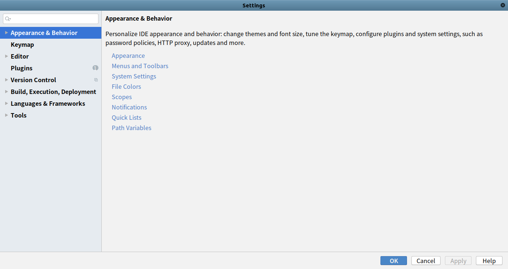
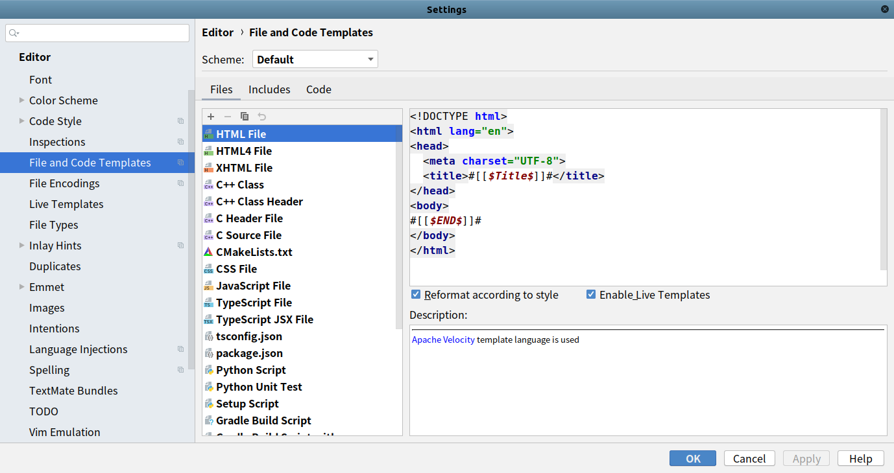

# 文件模板

参考：

[File and code templates](https://www.jetbrains.com/help/pycharm/using-file-and-code-templates.html#)

`JetBrains`提供了统一的文件模板定义方式

## 模板地址

点击菜单栏 `-> File -> Settings...`，打开系统设置



在右边侧边栏选择`Editor -> File and Code Templates` 



## 模板格式

以`PyCharm`为例，提供了许多的宏定义，参考[File and Code Templates](https://www.jetbrains.com/help/pycharm/settings-file-and-code-templates.html#)

修改`Python Script`如下：

```
# -*- coding: utf-8 -*-

"""
@date: ${DATE} ${TIME}
@file: ${NAME}.py
@author: zj
@description: 
"""
```

新建`Python`文件`voc_car`，生成如下内容：

```
# -*- coding: utf-8 -*-

"""
@date: 2020/2/29 下午2:43
@file: voc_car.py
@author: zj
@description: 
"""
```