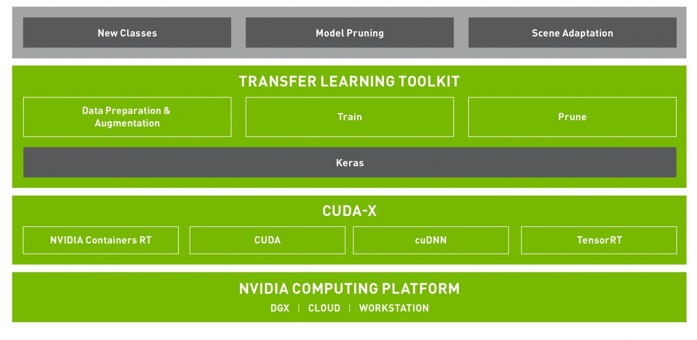
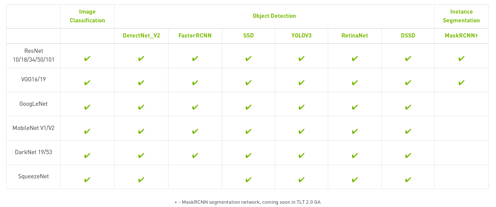
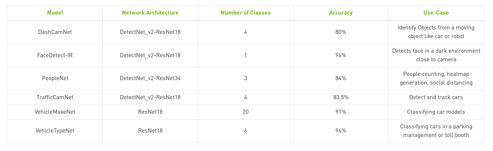
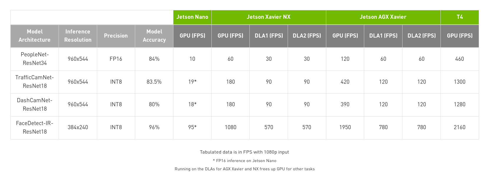

# 引言

`Nvidia`推出了一个深度学习训练工具包 - [Transfer Learning Toolkit](https://developer.nvidia.com/transfer-learning-toolkit)，提供了一堆的预训练模型，能够快速的迁移到新数据集上，完成训练并实现剪枝和量化操作

*下面记录一下`TLT`提供的预训练模型以及常见问题，更新版本的`TLT`会支持更多的功能，所以具体细节参考`TLT`官网*

## 预训练模型

`TLT`专注于图像分类和目标检测任务，提供了大量的预训练模型

同时`TLT`还提供了`6`个适用于具体场景的预训练模型以及相应的检测速度

## 常见问题

更多的问题参考官网，记录以下几个问题：

1. `TLT`使用了什么训练框架？是否需要学习它？
      1. 答：使用了`TensorFlow`和`Keras`，`TLT`完全封装了技术细节，不需要额外学习
2. 是否可以使用第三方预训练模型？
      1. 答：`TLT`不支持任何第三方预训练模型，仅支持`Nvidia NGC`提供的预训练模型
3. `TLT`是否支持分割任务?
      1. 答：目前不支持分割任务，不过会在后续版本中支持
4. `TLT`是否支持量化感知训练（`quantization aware training`）以及自动混合精度（`Automatic Mixed Precision(AMP)`）
      1. 答：`2020`年第`3`季度将推出`TLT 2.0`，实现`QAT（量化感知训练）`以提高`INT8`的准确性，并支持`AMP`

## 小结

从学习研究的角度来看，`TLT`并不是一个优秀的训练框架，相比于`PyTorch/TensorFlow`，无法自定义模型，没有提供更多的训练参数和方法；但是从部署的角度来看，`TLT`提供了打包一栈式的开发流程，能够快速的集成到实际生产中，当然，这也取决于`Nvidia`的更新速度