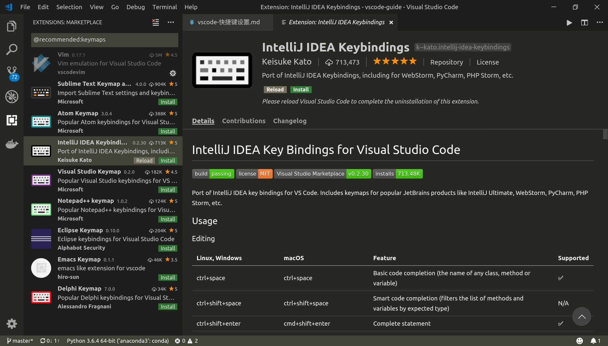
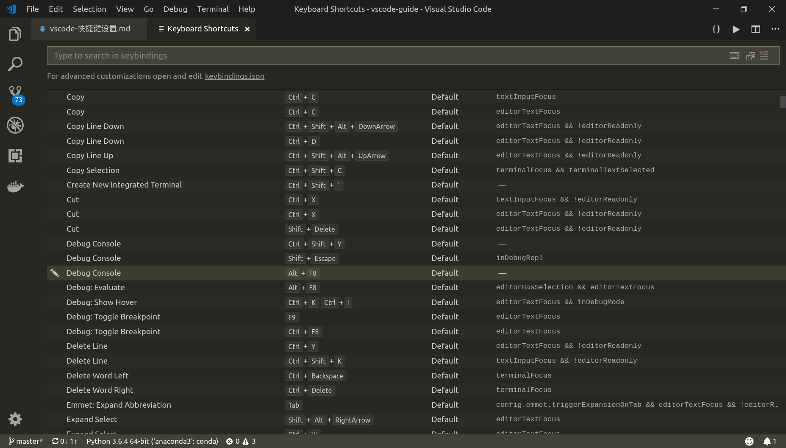
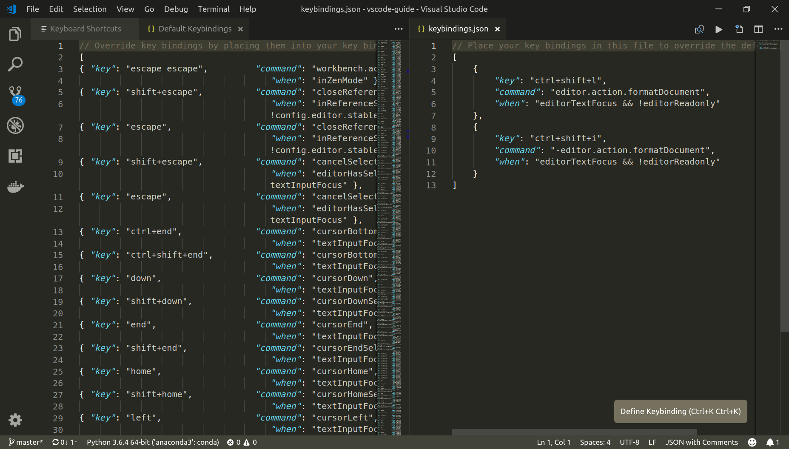

# VSCode快捷键设置

参考：[Key Bindings for Visual Studio Code](https://code.visualstudio.com/docs/getstarted/keybindings)

---

## 概述

`VSCode`默认使用`Visual Studio`的快捷键模板，可以根据需要自定义快捷键，或者选择合适
的快捷键模板

---

## 快捷键模板

参考：[Keymap extensions](https://code.visualstudio.com/docs/getstarted/keybindings#_keymap-extensions)

点击菜单栏`File > Preferences > Keymap Extensions`，将会显示多种编辑器的快捷键模
板，包括`Vim，IntelliJ IDEA`等等（需要在线安装）

---

## 自定义快捷键

参考：[Keyboard Shortcuts editor](https://code.visualstudio.com/docs/getstarted/keybindings#_keyboard-shortcuts-editor)

点击菜单栏`File > Preferences > Keyboard Shortcuts`，将会显示当前实现的快捷键方式

可以搜索相应的功能，然后在双击该条目，输入你想要实现的快捷键方式，就可以修改默认的快捷键

也可以通过`keybindings.json`文件修改

    $HOME/.config/Code/User/keybindings.json

